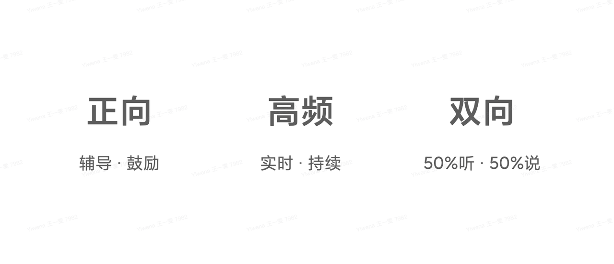

<!--
 * @Author: zhaokang zhaokang1@xiaomi.com
 * @Date: 2022-06-14 10:05:39
 * @LastEditors: zhaokang zhaokang1@xiaomi.com
 * @LastEditTime: 2022-06-14 10:22:33
 * @FilePath: /personal_growth/CFR持续性绩效管理.md
 * @Description: 这是默认设置,请设置`customMade`, 打开koroFileHeader查看配置 进行设置: https://github.com/OBKoro1/koro1FileHeader/wiki/%E9%85%8D%E7%BD%AE
-->
# 一、什么是CFR
CFR（Conversation + Feedback + Recognition）又名持续发展对话，是一种灵活持续的沟通与反馈工具，简单说就是「良好的一对一沟通」，可与上级聊一下最近的OKR进展、工作遇到的困难或收获等。
年度绩效评估的失败催生了一种强有力的替代品—持续性绩效管理。
它是OKR的近亲
- C:对话（Conversation）: 经理与员工之间真实的、高质量的交流，旨在对绩效提升起到驱动作用。
- F:反馈（Feedback）: 同事之间面对面进行双向沟通或通过网络进行交流，以评估工作进展情况并探讨未来的改进方向。
- R: 认可（Recognation）: 根据个体所做贡献的大小施以对等的表彰。

这套方法的基底遵循下面的一句话:

> 交流可以改变个体思维方式，进而改变个体行为方式，最终改变组织行为方式。

对行为感兴趣的朋友可以看《福格行为模型》这本书

> 领导者们历经苦痛才深刻领悟到的一个教训就是“不要把人数字化”。即便是彼得·德鲁克，这位目标管理的首创者，也认同标准化管理的局限性。在德鲁克看来，管理者的“首要角色”是“自己本身”，管理者需要和他人建立有效的人际关系，激发共同的信心，构建命运共同体。

# 二、特点

帮助上下级持续拉用目标，拉齐进度，解答疑问，过程指导。

- 拉通对齐：持续对OKR/工作进展和个人成长进行追踪，对现状、问题、原因和行动达成共识
- 教学相长：持续对话和辅导，让员工感受到被尊重和信任，提升贡献和价值，获得更好的绩效
- 激活团队：善于发现亮点，对个人行为和贡献给予及时、公开的赞扬，对整个团队来说都很有意义

# 三、如何进行CFR
1. CFR前的准备事项
提前梳理并思考：
- 现阶段OKR的相关工作，包括目标、进展、困难、思考等； 
- 近期表现是否超出/符合/不及预期？为什么？ 
- 有哪些方面成为了自己发展的瓶颈？
- 上级能在哪些方面帮你保持/改善/提升？
提前放平心态：
- 对于社恐的小伙伴，提前放松心态太重要啦，不要过于紧张，可以与主管聊深聊透

2. CFR中的注意事项
- 如果遇到不知如何作答的问题，不要长时间的沉默，可以坦诚相待或者换个切入点来解决这个问题
- 如果遇到委屈或愤怒的时刻，不要激烈争吵或暗自记恨，复杂的世界总会把误会放大，深呼吸后把话说开也许两个人会更亲近
3. CFR后的明确事项
- 上级的预期可能会随着业务变化而变化，因此要持续保持沟通
- 把本次沟通达成共识后的改进建议落实在笔记中持续跟踪改进

# 
