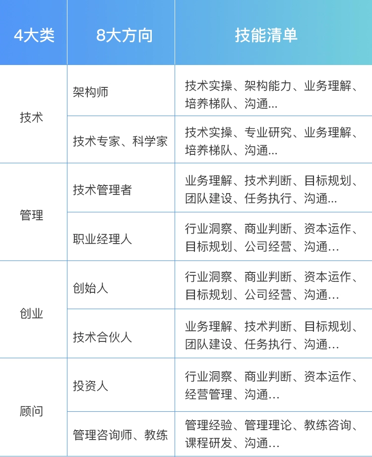

<!--
 * @Author: your name
 * @Date: 2022-03-30 10:13:48
 * @LastEditTime: 2022-05-06 16:30:42
 * @LastEditors: zhaokang zhaokang1@xiaomi.com
 * @Description: 打开koroFileHeader查看配置 进行设置: https://github.com/OBKoro1/koro1FileHeader/wiki/%E9%85%8D%E7%BD%AE
 * @FilePath: /personal_growth/技术管理者的职责.md
-->

# 技术管理者主要职责:

- 技术赋能商业、敏锐的商业洞察、深入的产业研究、参与公司战略规划， 技术引领业务增长， 通过技术和产品实现战略落地
- 技术趋势研究。思考未来3-5年的技术发展趋势， 以及新技术发展给企业带来的机遇和风险， 为企业提前布局
- 技术治理体系。持续的过程改进、高效的研发流程、稳定的交付质量、高可用的系统
- 组织与文化。 建设学习型组织、自我完善型组织，建立符合企业特色的文化氛围。

> 做技术和带团队，更像是职业发展的两条腿，而不是完全叉开的两条路。

# 技术人职业发展方向和技能清单

技术人无论未来如何发展，有些共同能力都是绕不开的，比如规划、带人、沟通、执行等管理能力。

无论你是否做技术管理岗，你所有的职业发展，都会围绕着技术和管理这两条腿在走路，一条腿是走不远的。