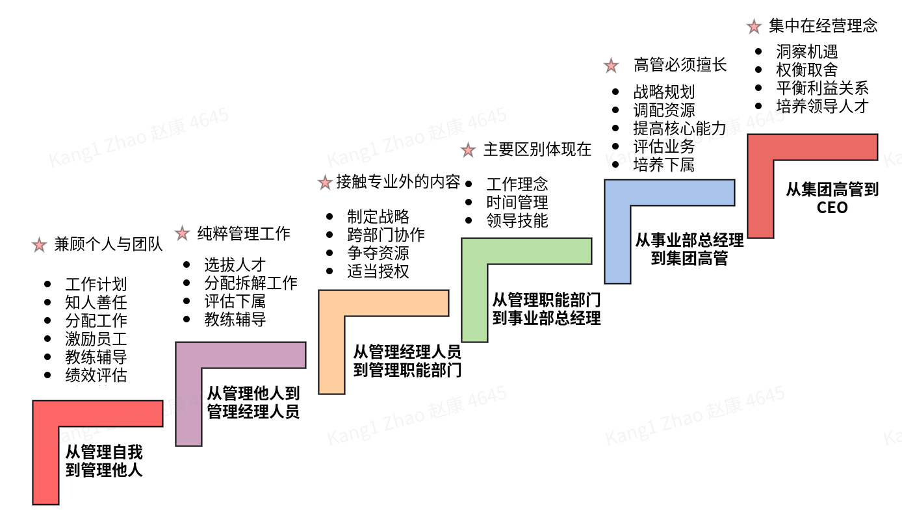
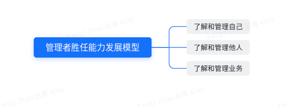

<!--
 * @Author: your name
 * @Date: 2021-12-28 12:02:18
 * @LastEditTime: 2021-12-28 12:02:19
 * @LastEditors: Please set LastEditors
 * @Description: 打开koroFileHeader查看配置 进行设置: https://github.com/OBKoro1/koro1FileHeader/wiki/%E9%85%8D%E7%BD%AE
 * @FilePath: /personal_growth/领导梯队笔记.md
-->

微信原文阅读: https://mp.weixin.qq.com/s?__biz=MzI1MjA2NzQ3Ng==&mid=2457137828&idx=1&sn=23a4a8b92dc9e244244876753b6bca76&chksm=fe69395fc91eb0494a8138477b5a91372a9c30302cdf4c6d64965f5b3ddce199d560b14d01ae&token=1235807397&lang=zh_CN#rd
知乎原文阅读: https://zhuanlan.zhihu.com/p/464603459

> 一线经理： 管理能力80% + 领导能力20%
高管：        管理能力20%  + 领导能力80%

# 二、改变：先行动后思考(习惯的改变)
认知、习惯、改变
> 福格行为模型，是怎样让行为发生改变的？
原理：行为模型三要素：动机+能力+提示

动机：是指想做某件事的动机
能力：是做某件事需要的能力
提示：是指某个习惯触发了某件事
 
按照这个模型，去设计这3个要素。当同时具备了这3个要素，行为就能发生改变

# 三、能力的三次跃升
一个人在层级上升时候有三次的能力转变。

## 3.1 从管理自我到管理他人。

在做底层员工时候，只要自己执行能力强，想方设法完成任务就可以。说白了，只要你是领导一件趁手的工具，就已经是很突出的表现了。但是如果一旦开始带团队，需要的能力完全不一样。 这是一个从自己完成工作，到通过他人完成工作的转变。很多职场里能干的人，都被挡在这个台阶上，再难突破，为什么？
因为他当团队领导，仍然凡事逞能，动不动就是“你不行，闪开看我的”。他没办法做到发自内心的成就他人。
这个转变包含很多方面。比如，你的时间分配要改变： 必须开始减少花在个人工作上的时间，要把时间花在帮助、鼓励下属上；要设计岗位和分配任务；学会放手让下级完成任务，并定期考核；还要建立社会关系，包括纵向跟上下级、横向跟其他部门的人建立关系等。

## 3.2 从一个"管理者"转变成一名“组织者"。

**第二级，就算你成功做出转变，下一级难关在等着你——从一个"管理者"转变成一名“组织者"。
管理者的任务，还是局限在工作本身，但是组织者就必须要战略思维了。换句话说，眼前的事没有那么重要，你要把眼光放开，注意到更大范围的事情。** 

眼光放开，是指两个维度放开。
第一个是时间维度。现在的工作也许顺利，也许艰难，但更重要的是未来趋势。
远处有没有还没有出现的潜在对手？顺利发展，会不会正在积累危机？艰难前进，前方会不会柳暗花明？有了这些判断，再反过来做当下的决策，才是一个组织者的任务。
第二个是空间维度。组织内的资源，是看见的，但是组织外的资源，那可就是汪洋大海了。
和谁协作，拉谁入伙？ 在体外储备什么样的资源，预留什么样的可能？ 树什么敌人，交什么朋友？ 释放什么样的信息？等等等等。

## 3.3 就是从"组织者"变成“决策者”。
组织者的重点仍然是行动，但是决策者只有一个重点，就是判断。这个层次的思维模式和认知水平，又和之前的完全不一样。你关注的是，积累知识水平，揣摩人心，局势和趋势。
做一件事，在理论上是对的，但是时机不对呢？ 是该马上做，还是再等等？做一个动作，效果是好的，但是间接效果是什么？负面效果能不能控制住？两件事都该做，做哪个才是真正的重点？ 两方面意见都有道理，该怎么表态，才能让各方面都口服心服？
决策者、判断者有一个天然的宿命，就是及其孤独。别人都是在行动，在提意见，只要做好自己该做的就行。而决策者, 要独自承当决策的后果和责任。这份压力，没法分担，无处化解，必须一个人扛下来。

# 四、管理者胜任能力发展模型

# 五、关键能力
## 5.1 情商/自我觉察能力
分析和认清自己的优势和弱点、态度和感受。
具备这项能力的员工对自己的目标、能力和局限性有一个清晰而实际的认识；
他会为自己工作的有效性寻求反馈，并根据反馈做出改变；
他理解自己的内在感受，并知道这些感受是如何影响他的行为与工作绩效的，他能恰当地表达自己的感受和反应。

行为说明1：就自己的表现主动向别人征求积极的、建设性的反馈。
行为说明2：根据反馈调整个人行为。
行为说明3：在沟通中，能够理解他人的感受和关注点，并回应他们表达的或潜在的需求。
行为说明4:了解自己在制定决策、解决问题和与他人合作时的个人偏好，并能认识到自己所偏好的风格在某些情况下可能不是最有效的方法。
行为说明5：通过问问题的方式创造一种氛围，让他人感觉到能够自如地讨论当前的处境，分享他们所关注的问题。
行为说明6：沉着、清晰地表达自己的感受和想法。
行为说明7：即使在他人不开心或者感到困惑的情况下，也能得体地沟通。
行为说明8：教练他人理解自我觉察的重要性，以及如何提升自我觉察能力。
## 5.2 培养可迁移的通用能力

什么是可迁移的通用能力呢？　就是无论你是做数据分析还是业务战略，无论你是从事互联网还是金融，是做咨询还是做实施。无论你做任何职业与行业装换，这些技能都是你可以立马用上的。

**而迁移的通用技能最核心最能发挥价值的就是沟通能力和向上管理能力**
然而，职场中的通用技能是每个人都无法忽视的必修课。而且这些技能都还有一个共通点：那就是无论在学校亦或教育机构都没有针对性的培训，需要大家在职场中自我学习，一点一滴的积累。

所以在学有所成之前，难免会在这些通用技能上“栽跟头”、“吃苦头”，小则会丧失职业发展机遇，大则会对职业生涯产生不可逆转的伤害。

## 5.3 做好向上汇报
**对于汇报者来说，任何一次“向上汇报”都是向他人展示自己能力的机会和舞台。**

[如何向上汇报](https://mp.weixin.qq.com/s/wNfWzvhlS1o-YvrQ9uVUfQ)

# 六、需要思考的问题
1. 如何在管理好团队的前提下，还能保证自己业务和技术能力？
2. 梯队建设， 核心骨干如何培养
3. 组织能力： 如何管理好90后、00后员工（面试、试用期注意筛选等）
4. 研发部门的横向影响有哪些，提高岗位价值
5. 当前层级如何向上晋升？
6. 沟通的技能和训练
7. 汇报能力

**需要改进的事情**
1. 注意沟通的尺度，和光同尘（意思是指不露锋芒，与世无争的处世态度。）
2. 不要轻视不直接产生实践价值的理论知识（业务、管理、思维模型）。低p看基础与潜力，高p看思维与技术深度（胜任能力是潜力，只有在恰当的领导与激励之下，才能变成高绩效行为和成果。）
3. 合理放权，让二级梯队owner项目和问题，进度把控，风险把控，重点把控
4. 沟通是中有效的交互也很重要
5. 汇报是成功的基石

# 参考书目
- 《能力陷阱》
- 《终身成长》
- 《福格行为模型》
- 《认知觉醒：开启自我改变的原动力》 
- 《认知驱动：做成一件对他人有用的事》
- 《内在动机：自主掌控人生的力量》
- 《影像力大师：如何调动团队力量》
- 《关键跨域》
- 《关键对话》
- 《向上管理的艺术：正确汇报工作》
- 《精力管理》
- 《正面管教》
